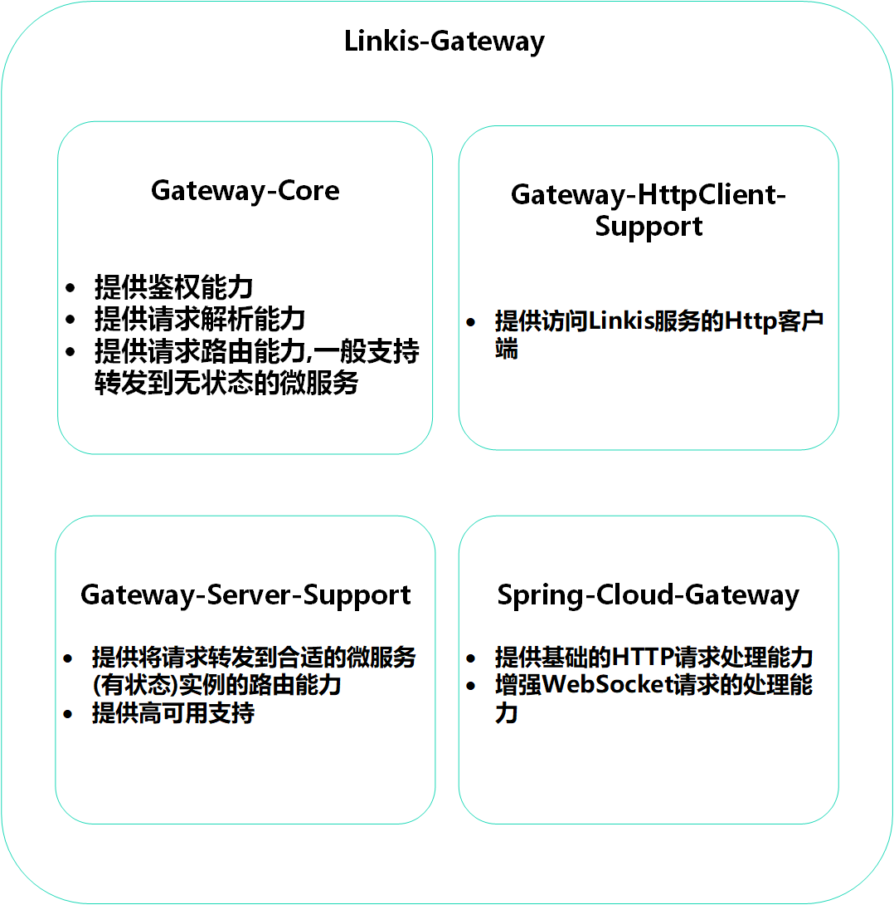

Linkis Gateway架构文档
===============

1.Gateway的模块划分
-------------------

图1-1 gateway的模块划分

如图1-1所示，Gateway主要是划分成了四个模块，如下

1.**gateway-core**:提供linkis-gateway的鉴权能力，HTTP或WebScoket请求的解析能力，将请求转发到正确微服务实例(这些微服务往往是无状态的)的路由能力。

2.**gateway-httpclient-support**:提供访问Linkis的Http客户端。

3.**gateway-server-support**:将执行、上下文、标签等特殊请求路由到正确的微服务实例(这些微服务往往是有状态的)，并提供高可用支持。

4.**spring-cloud-gateway**:提供基础的HTTP请求处理能力，并增强了Websocket请求处理能力。

2.Gateway模块的功能介绍
-----------------------

### 2.1 gateway-core

gateway-core模块有三个组件详细描述如表2-1。

| 组件名   | 组件功能                                                                                         |
|----------|--------------------------------------------------------------------------------------------------|
| Parser   | 解析用户的请求,为路由做预处理                                                                    |
| Router   | 将用户的请求路由到正确的微服务实例，这些微服务一般是无状态的，如ResourceManager,public service等 |
| Security | 1.提供登录能力 2.提供拒绝非法请求能力                                                            |

表2-1

### 2.2 gateway-httpclient-support

gateway-httpclient-support模块有三个组件，详细描述如表2-2。

| 组件名            | 组件功能                                        |
|-------------------|-------------------------------------------------|
| Client            | 提供统一的http客户端，方便用户与Linkis交互      |
| Strategy          | 提供多种鉴权策略供用户选择，以通过gateway的鉴权 |
| Action and Result | 封装了Linkis的请求与返回，方便用户进行使用      |

表2-2

### 2.3 gateway-server-support

gateway-server-support模块有三个组件，详细描述如表2-3。

| 组件名               | 组件功能                                     |
|----------------------|----------------------------------------------|
| ContextServiceRouter | 智能转发携带上下文的请求到合适的上下文服务器 |
| LabelRouter          | 将携带标签的请求转发到被打了标签的服务       |
| EntranceRouter       | 将执行相关请求转发到合适的Entrance服务实例   |

表2-3

### 2.4 spring-clout-gateway

spring-cloud-gateway模块有三个组件，详细描述如表2-4。

| 组件名            | 组件功能                                                    |
|-------------------|-------------------------------------------------------------|
| Http请求处理模块  | 提供基础的Http请求处理能力,如header、cookie处理等           |
| WebSocket请求模块 | 提供websocket请求的处理能力,包括一对多的websocket转发能力等 |

表2-4
